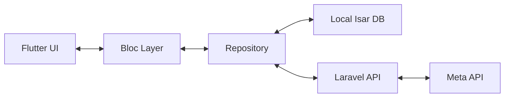

# 📱 WhatsApp Pro Mobile: Flutter High-Performance Build Plan

## 🌟 Vision
A "Zero-Latency" Flutter application that connects your Laravel WhatsApp Business system to your agents' mobile devices. Designed with a premium Material 3 UI, smooth 60 FPS animations, and native-feeling interactions.

---

## 🛠 Technology Stack

| Layer | Technology | Rationale |
| :--- | :--- | :--- |
| **Frontend** | **Flutter** | High-performance rendering (Impeller), single codebase, and native-feeling UI components. |
| **Animations** | **Flutter Animation Controller** | Built-in high-performance animation engine for smooth transitions. |
| **State** | **flutter_bloc** | Robust, predictable state management for complex messaging flows. |
| **Real-time** | **laravel_echo / socket_io_client** | Connect to existing Laravel broadcasting system. |
| **Local DB** | **Isar / Hive** | Highly efficient, NoSQL local database for messaging storage. |
| **Auth** | **Laravel Sanctum (Mobile)** | Secure token-based authentication with auto-refresh. |

---

## 🗺 Implementation Roadmap

### Phase 1: Backend Infrastructure (Laravel)
*Objective: Build the bridge for the mobile app.*

- [ ] **1.1. Push Notification Engine (FCM)**
    - [ ] Create `UserFcmToken` model and migration (fields: `user_id`, `token`, `player_id`, `device_info`).
    - [ ] Set up Firebase Admin SDK in Laravel.
    - [ ] Implement `FcmService` for multi-device delivery.
- [ ] **1.2. API V1 - Mobile Core**
    - [ ] Implement `MobileAuthController` (Login/Logout/Password Reset/Refresh Token).
    - [ ] Create `MobileConversationController` with highly-optimized index (paginated, search-enabled).
    - [ ] Implement `MobileMessageController` (List messages with cursors, send message, upload media).
- [ ] **1.3. Event-Driven Notifications**
    - [ ] Link `MessageReceived` event to `SendPushNotificationListener`.
    - [ ] Implement conditional notifications (don't send if the user is already active in that chat).

### Phase 2: Flutter Foundation & Architecture
*Objective: Set up a clean, scalable mobile project.*

- [ ] **2.1. Project Setup**
    - [ ] Initialize Flutter project (Flavoring: `dev`, `staging`, `prod`).
    - [ ] Configure `dio` for API calls with interceptors for Sanctum tokens.
- [ ] **2.2. Theme & Design Tokens**
    - [ ] Implement "WhatsApp Green" palette using HSL tokens.
    - [ ] Setup Material 3 Theme with custom Typography (InterFont).
- [ ] **2.3. Data Layer (Isar)**
    - [ ] Create Isar schemas for `LocalConversation` and `LocalMessage`.
    - [ ] Implement `ChatRepository` (SSOT - Single Source of Truth pattern).

### Phase 3: Auth & Identity Flow
*Objective: Secure and seamless user onboarding.*

- [ ] **3.1. Authentication Block**
    - [ ] Build Login UI with premium text field micro-interactions.
    - [ ] Implement `AuthBloc` (Unauthenticated -> Authenticating -> Authenticated).
- [ ] **3.2. Session Persistence**
    - [ ] Securely store JWT/Sanctum tokens using `flutter_secure_storage`.
    - [ ] Handle auto-logout on token expiration.

### Phase 4: Real-time Messaging System
*Objective: "It just works" real-time sync.*

- [ ] **4.1. WebSocket Bridge**
    - [ ] Integrate `laravel_echo` plugin.
    - [ ] Subscribe to user-specific channels (`private-user.{id}`).
- [ ] **4.2. Chat Sync Engine**
    - [ ] Implement `MessageBloc` for real-time state updates.
    - [ ] Optimistic UI: Immediately show "sending" message in UI.
    - [ ] Update message status (`sent` -> `delivered` -> `read`) via socket.

### Phase 5: Premium Chat UI (The "Wow" Factor)
*Objective: Fluid, high-performance messaging interface.*

- [ ] **5.1. Conversation Home**
    - [ ] List View with "Infinite Scroll".
    - [ ] Shimmer loading effects for a premium feel.
    - [ ] Search functionality (local + remote).
- [ ] **5.2. Chat Bubbles & Interactions**
    - [ ] Custom `ChatBubble` widget (Bezier-curved corners, shadow gradients).
    - [ ] Swipe-to-reply gesture implementation.
    - [ ] Support for media types (Images with Hero transitions, PDF preview).
- [ ] **5.3. Media Handling**
    - [ ] Background uploaders for large images/videos.
    - [ ] Progressive image loading (Blur-hash).

### Phase 6: Sync & Offline Support
*Objective: Uninterruptible communication.*

- [ ] **6.1. Smart Sync Logic**
    - [ ] Background sync when the app is opened to fetch "missed" messages since last socket connection.
- [ ] **6.2. Offline Drafts**
    - [ ] Allow sending messages while offline; automatically sync when back online.

### Phase 7: Deployment & Polishing
*Objective: Production-ready handoff.*

- [ ] **7.1. Performance Audit**
    - [ ] Fix memory leaks in large image lists using `dispose` logic.
    - [ ] Ensure 0 frame drops during heavy list scrolling.
- [ ] **7.2. Release Cycle**
    - [ ] Configure `Fastlane` for auto-deployment to App Store Connect & Play Console.
    - [ ] Google Play/App Store assets creation.

---

## 🏗 Architecture Diagram

